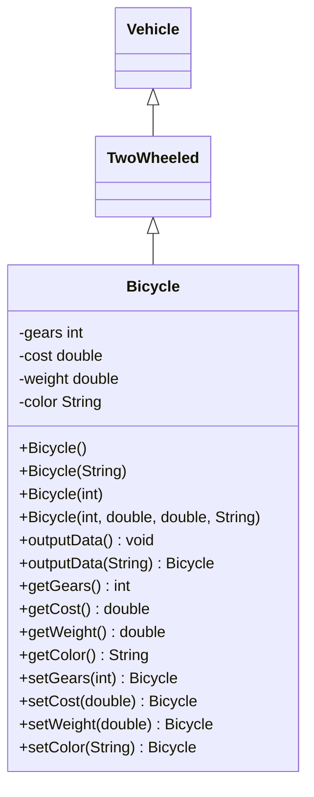

# Module 1 UML Class Diagram

Several key object-oriented programming principles are illustrated in this class diagram:

1. Inheritance
   - There's a clear inheritance hierarchy: Bicycle inherits from TwoWheeled, which inherits from Vehicle
   - This demonstrates the "is-a" relationship (as tested in your Driver.java): a Bicycle is-a TwoWheeled vehicle, which is-a Vehicle
   - This inheritance is shown in the diagram using the arrow notation `<|--`
   - The Driver.java's instanceof checks confirm these relationships

2. Encapsulation
   - The Bicycle class demonstrates encapsulation by:
     - Making all instance variables private (shown with `-` in the diagram)
     - Providing public getters and setters (shown with `+` in the diagram)
   - This ensures that the internal state can only be accessed through controlled interfaces

3. Method Overloading
   - The Bicycle class shows method overloading in two ways:
     - Multiple constructors with different parameter lists
     - Two versions of outputData(): one with no parameters and one taking a String parameter

4. Method Chaining
   - All setter methods return the Bicycle instance (return type Bicycle)
   - This enables fluent interface design as shown in Driver.java where methods can be chained:
     `myBike5.setColor("Peach").setGears(32).outputData("Number 5");`

5. Abstraction
   - The Vehicle and TwoWheeled classes are abstract in nature (though not formally abstract classes)
   - They provide a hierarchical abstraction of what it means to be a vehicle and a two-wheeled vehicle
   - The specific implementation details are left to the Bicycle subclass

These principles work together to create a clean, maintainable, and extensible design where:
- New vehicle types could easily be added to the hierarchy
- The Bicycle class's implementation details are protected from outside interference
- The interface is flexible and user-friendly through method overloading and chaining

The Driver.java file demonstrates how these principles make the code more usable and robust through various instantiation patterns and type checking.